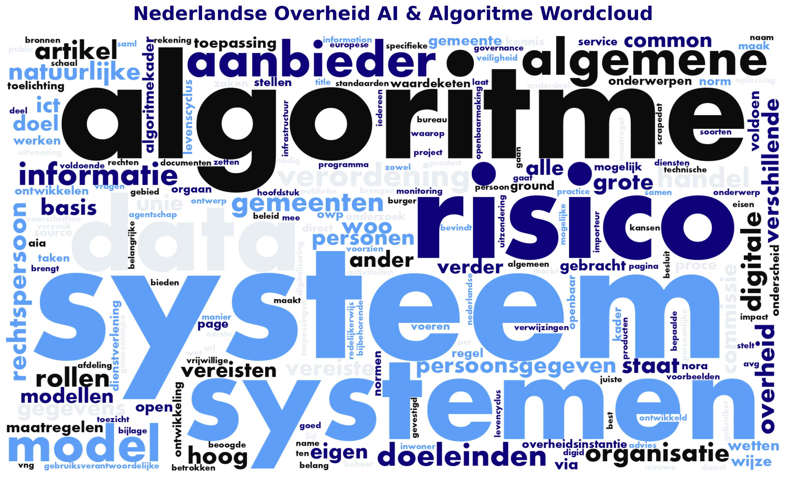

# Digital Assistant Quality Starter

A comprehensive starter kit for building high-quality digital assistants for the Dutch government (Nederlandse Overheid). This project provides datasets, best practices, and a full-stack platform to help developers create AI-powered assistants that comply with regulations and guidelines.

##  Overview

This repository contains everything you need to develop a digital assistant that meets quality standards for public sector applications:

- **Curated Datasets**: Extensive collection of Dutch government guidelines, regulations, and best practices
- **Best Practices**: Documentation on AI governance, ethics, and compliance
- **Full-Stack Platform**: Ready-to-use application with React frontend and FastAPI backend
- **Feedback System**: Tools for collecting and incorporating user feedback

##  Project Structure

`
 1. Datasets/          # Dataset with scraped content and processed documents
 2. Best Practices/    # Best practices documentation
 3. Platform/          # Main application
    backend/          # Python FastAPI backend
    src/              # React frontend
    ...
 4. Feedback/          # Feedback documentation
`

##  Quick Start

### Prerequisites

- Python 3.8+
- Node.js 16+
- GreenPT API Key

### Backend Setup

`ash
cd "3. Platform/backend"
cp .env.example .env
# Add your GREENPT_API_KEY to .env

python -m venv venv

# Windows:
.\venv\Scripts\activate
# Linux/Mac:
source venv/bin/activate

pip install -r requirements.txt
python start.py
`

### Frontend Setup

`ash
cd "3. Platform"
cp .env.example .env  # Optional
npm install
npm run dev
`

### Access the Application

- **Frontend**: http://localhost:3000
- **Backend API**: http://localhost:8000
- **API Documentation**: http://localhost:8000/docs

##  Datasets

The `1. Datasets` folder contains:

- Scraped content from Dutch government sources
- Processed markdown documents covering:
  - AI regulations and compliance (EU AI Act, AVG/GDPR)
  - Algorithm governance and risk management
  - Digital accessibility guidelines
  - Common Ground principles
  - Public sector IT standards (NORA, GEMMA)
  - And much more...

##  Features

- **RAG-based Responses**: Leverages Retrieval-Augmented Generation for accurate answers
- **Source Citations**: Provides references to official documentation
- **Compliance-Ready**: Built with Dutch government regulations in mind
- **Modular Architecture**: Easy to extend and customize

##  Contributing

Contributions are welcome! Please feel free to submit a Pull Request.

##  License

This project is licensed under the MIT License - see the [LICENSE](LICENSE) file for details.

##  Need Help?

- Check [HACKATHON_QUICKSTART.md](HACKATHON_QUICKSTART.md) for quick setup
- Review the README files in each folder for more information
- Explore the [3. Platform/SETUP_GREENPT.md](3.%20Platform/SETUP_GREENPT.md) for detailed setup instructions

##  Acknowledgments

- Dutch Government (Rijksoverheid) for public documentation
- VNG (Vereniging van Nederlandse Gemeenten) for Common Ground resources
- All contributors to the open government ecosystem
